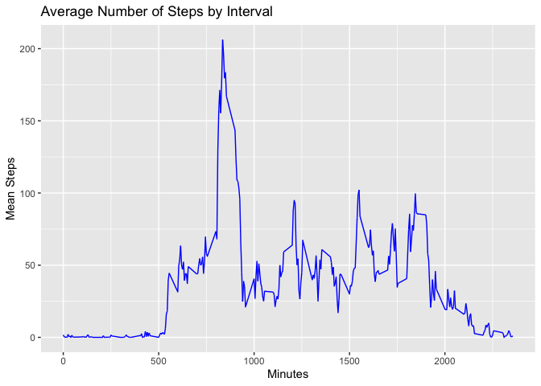

```r
library(knitr)
library(dplyr)
```

```
## 
## Attaching package: 'dplyr'
```

```
## The following objects are masked from 'package:stats':
## 
##     filter, lag
```

```
## The following objects are masked from 'package:base':
## 
##     intersect, setdiff, setequal, union
```

```r
library(ggplot2)
knitr::opts_chunk$set(echo = TRUE)
```
1. Reading in the dataset:

```r
project=read.csv(file='~/Desktop/activity.csv')
```

Total number of steps taken per day: 

```r
project1= project %>% 
        group_by(date) %>%                       
        mutate(total_steps=sum(steps)) 
```

2. Histogram: 

```r
p1= ggplot(data=project1, aes(total_steps)) + 
        geom_histogram(bins=20, col="blue", fill="lightblue") +
        labs(title="Histogram of Total Steps", x="Total Steps", y="Count")
print(p1)
```

```
## Warning: Removed 2304 rows containing non-finite values (stat_bin).
```

<!-- -->

3. Mean and median of the total number of steps taken per day:

```r
mean(project1$total_steps, na.rm=T)
```

```
## [1] 10766.19
```

```r
median(project1$total_steps, na.rm=T)
```

```
## [1] 10765
```

4. Time series plot of the average number of steps taken:

```r
project_time= project %>% 
        group_by(interval) %>%
        filter(!is.na(steps)) %>%
        mutate(mean_steps_int= mean(steps))
p2= ggplot(project_time, aes(x=interval, y=mean_steps_int)) +
        geom_line(col = "blue") +
        labs(title="Average Number of Steps by Interval", x="Minutes", y="Mean Steps")
print(p2)
```

<!-- -->

5. The 5-min interval with (on average) the maximum number of steps:

```r
max(project_time$mean_steps_int)
```

```
## [1] 206.1698
```

```r
max= project_time %>% filter(mean_steps_int>206)
glimpse(max$interval)
```

```
##  int [1:53] 835 835 835 835 835 835 835 835 835 835 ...
```
The interval with the most steps is 835.  

6. Imputing missing data:

```r
nas= project %>%
        filter(is.na(steps))
```
There are 2304 NAs in the dataset. Let's impute them using the mean value per interval:

```r
project2= project %>%
        group_by(interval) %>%
        mutate_at(vars(steps), ~ifelse(is.na(.), mean(., na.rm = TRUE),.))
project2= project2 %>% 
        group_by(date) %>%                       
        mutate(total_steps=sum(steps)) 
```
Let's check that imputation occurred successfully.

```r
nas2= project2 %>%
        filter(is.na(steps))
nrow(nas2)
```

```
## [1] 0
```
There are now 0 NAs in the dataset. Good times!

7. Histogram and averages post-imputation:  

```r
p3= ggplot(data=project2, aes(total_steps)) + 
        geom_histogram(bins=20, col="blue", fill="lightblue") +
        labs(title="Histogram of Total Steps, With Imputed Data", x="Total Steps", y="Count")
print(p3)
```

<!-- -->

```r
summary(project2$total_steps, na.rm=T)
```

```
##    Min. 1st Qu.  Median    Mean 3rd Qu.    Max. 
##      41    9819   10766   10766   12811   21194
```
As we can see here, the effect of imputing data on the central tendency is subtle-- the median increased by 1 step/day, and the mean decreased by a small fraction of one step per day.

8. Panel plot comparing weekends and weekdays:

```r
#Weekday vs weekend
project2$date= as.Date(project2$date) 
project2$day= weekdays(project2$date)

project2= project2 %>% 
        mutate(daytype = ifelse(day %in% c("Saturday", "Sunday"), "Weekend", "Weekday"))

project3= project2 %>%
        group_by(interval, daytype) %>%
        mutate(mean_steps_int_new= mean(steps))

#Plot
p4= ggplot(project3, aes(x=interval, y=mean_steps_int_new, col=daytype)) +
        geom_line() +
        facet_grid(daytype~.) + 
        labs(title= "Average Steps per Interval by Weekday vs. Weekend", x="Minutes", y="Mean Steps")
print(p4)
```

<!-- -->

There do seem to be differences in activity patterns on weekdays vs. weekends. On weekends, the activity seems more spread out during the day and also starts later, indicating longer sleep in the morning. 
